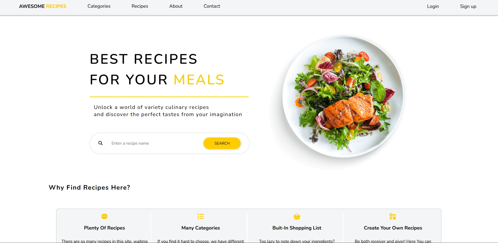
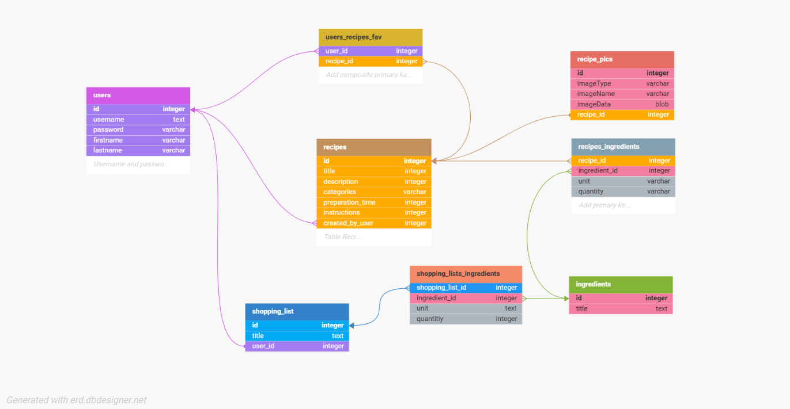
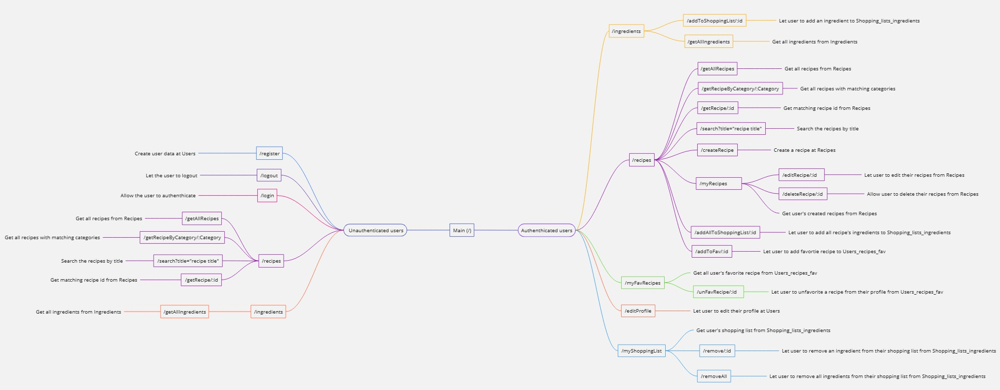

# Awesome Recipe Full Stack Project :bento:

## Description :pencil:
Create a web application that allows users to search, store, and manage their recipes. The system should enable users to browse recipes, save their favorite recipes, create new recipes, and organize them into categories or collections.

## Homepage Demo :camera:

## Database Diagram :large_blue_circle:

## API Endpoints Diagram :twisted_rightwards_arrows:

## Project Hosting :globe_with_meridians:
This project is currently being hosted at [awesome-recipe-static.onrender.com](https://awesome-recipe-static.onrender.com). Click the link to visit the site.

<mark>The first api call operation will be quite slow as this is a free render plan</mark>, so it will be slow or even error at first, but can be fixed by wait a little then refreshing the page.

## Key Features :pushpin:
- **User Authentication**: Allow users to sign up, log in, and manage their profiles securely.
  
- **Recipe CRUD Operations**: Implement functionality for users to create, read, update, and delete recipes.
  
- **Recipe Search**: Enable users to search for recipes based on title.
  
- **Favorite Recipes**: Allow users to save recipes to their favorites list for easy access later.
  
- **Recipe Categorie**s: Provide the ability for users to organize recipes into categories (e.g., breakfast, lunch, dinner, desserts, snacks).
  
- **Shopping List Integration** :memo:: Allow users to add ingredients from recipes to a shopping list for convenient meal planning and grocery shopping.

## Future Improvement :soon:
- Responsive design on the frontend.
  
## Technologies :computer:
- **Backend**: Node.js with Express
- **Database**: PostgreSQL
- **Database Connection**: Sequelize
- **Authentication**: Implement secure authentication using JWT token sent through cookies
- **Frontend**: Use HTML5, CSS, and JavaScript along with REACT for building the user interface and REDUX for state management.
- **Deployment**: Deploy the application on cloud platforms using Render for accessibility.

## Environment variables :deciduous_tree:
The following variables are required to run the program.
- `USER`
- `PASS`
- `PORT`
- `SECRET`

`USER`, `PORT`, and `PASSWORD` can be obtained from your local configuration.
`SECRET` can be generated on your own choosing.
